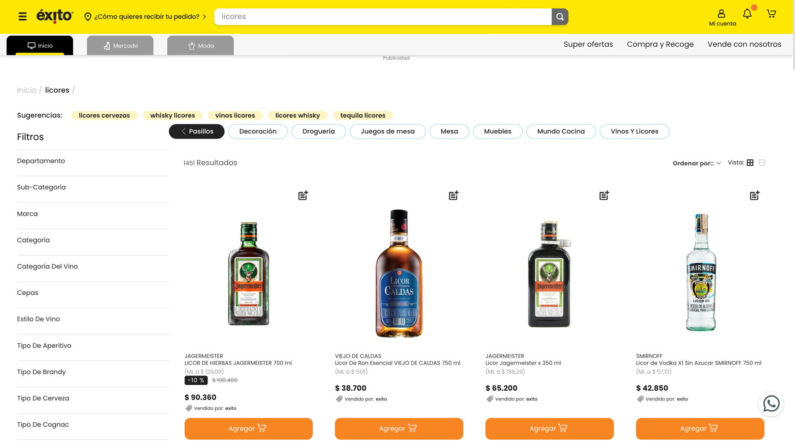
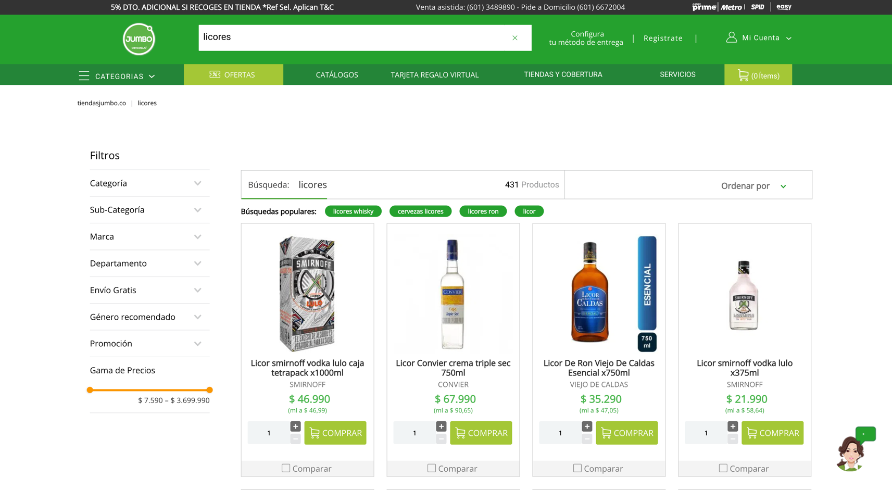

# Práctica 1: Web scraping 

## Tecnologias

 

# Integrantes

[](https://www.linkedin.com/in/carlos-andres-rivera-rivera-72213069/)

[](https://www.linkedin.com/in/carlos-andres-rivera-rivera-72213069/)

# Descripción

| https://www.exito.com/licores?_q=licores&map=ft| https://www.tiendasjumbo.co/licores?_q=licores&map=ft |
|-------|----------|
|  |  | 

# Ficheros del código fuente

* **src/shopExitoSelenium.py**: Realiza el proceso de scraping a site: https://www.exito.com/licores?_q=licores&map=ft  usando la librería de selenium y driver de navegador, se configuró para que realice el proceso en segundo plano. 
* **src/shopJumboSelenium.py**: Realiza el proceso de scraping a site: https://www.tiendasjumbo.co/licores?_q=licores&map=ft usando la librería de selenium y driver de navegador, se configuró para que realice el proceso en segundo plano.
* **src/compararPrecios.py**: Crea archivo csv comparando los dos precios en tiendas por coincidencias entre productos..

# Librerias Necesarias

Para ejecutar el script es necesario instalar la siguientes librerias:
```
pip install pandas
pip install webdriver
pip install selenium
```

# Recursos